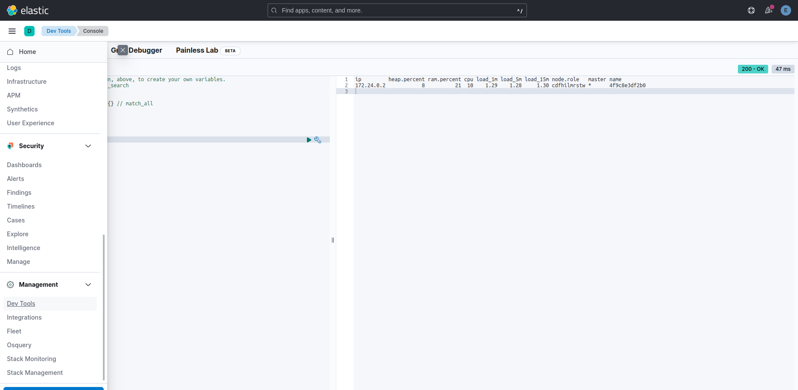

# Installing Elasticsearch on Linux by Docker

Pls ses this [link](https://www.elastic.co/guide/en/elasticsearch/reference/current/docker.html) to install Elasticsearch

**1. Pull the Elasticsearch Docker Image:** 
```
sudo docker pull docker.elastic.co/elasticsearch/elasticsearch:8.9.0
```  

**2. Create a new docker network for Elasticsearch and Kibana**   
```
sudo docker network create elastic
```


**3. Start Elasticsearch in Docker**  

A password is generated for the elastic user and output to the terminal, plus an enrollment token for enrolling Kibana.

```
sudo docker run --name es01 --net elastic -p 9200:9200 --memory 6g -e "discovery.type=single-node" --env ES_JAVA_OPTS="-Xmx4g" -it docker.elastic.co/elasticsearch/elasticsearch:8.9.0
```

Because of the default Elasticsearch, it will allocate 50% memory RAM of your machine. So you can limit it by `--memory 6g -e "discovery.type=single-node" --env ES_JAVA_OPTS="-Xmx4g"`  

Copy the generated password and enrollment token and save them in a secure location. These values are shown only when you start Elasticsearch for the first time.  

When it run success, it should be like this:

```
✅ Elasticsearch security features have been automatically configured!
✅ Authentication is enabled and cluster connections are encrypted.

ℹ️  Password for the elastic user (reset with `bin/elasticsearch-reset-password -u elastic`):
  p62ZmjA5clbVUUur5Tgd
```  

If you need to reset the password for the elastic user or other built-in users, run the elasticsearch-reset-password tool. This tool is available in the Elasticsearch /bin directory of the Docker container. For example:  

```
sudo docker exec -it es01 /usr/share/elasticsearch/bin/elasticsearch-reset-password
```  

**4. Copy the http_ca.crt security certificate from your Docker container to your local machine.**

```
sudo docker cp es01:/usr/share/elasticsearch/config/certs/http_ca.crt .
```  
Ensure that file have permission to read by this command:  

```
$ sudo chmod +r http_ca.crt 
```

**5. Test**  

Open a new terminal and verify that you can connect to your Elasticsearch cluster by making an authenticated call, using the http_ca.crt file that you copied from your Docker container. Enter the password for the elastic user when prompted.

```
curl --cacert http_ca.crt -u elastic https://localhost:9200
```

The result should be like this:

```
$ curl --cacert http_ca.crt -u elastic https://localhost:9200
Enter host password for user 'elastic':
{
  "name" : "4f9c8e3df2b0",
  "cluster_name" : "docker-cluster",
  "cluster_uuid" : "hovFelb0Sjm2xEyh-TrVHQ",
  "version" : {
    "number" : "8.9.0",
    "build_flavor" : "default",
    "build_type" : "docker",
    "build_hash" : "8aa461beb06aa0417a231c345a1b8c38fb498a0d",
    "build_date" : "2023-07-19T14:43:58.555259655Z",
    "build_snapshot" : false,
    "lucene_version" : "9.7.0",
    "minimum_wire_compatibility_version" : "7.17.0",
    "minimum_index_compatibility_version" : "7.0.0"
  },
  "tagline" : "You Know, for Search"
}
```

You also check by open the new web and enter: `https://localhost:9200`  

Enter User is `elastic` and Password as above when it generated. It will return the JSON like above.

# Installing Kibana on Linux by Docker

Pls ses this [link](https://www.elastic.co/guide/en/kibana/current/docker.html) to install Kibana.  

**1. Pull the Kibana image:**  

```
sudo docker pull docker.elastic.co/kibana/kibana:8.9.0
```

**2. Start Kibana:**

```
sudo docker run --name kib-01 --net elastic -p 5601:5601 docker.elastic.co/kibana/kibana:8.9.0
```

The result:

```
$ sudo docker run --name kib-01 --net elastic -p 5601:5601 docker.elastic.co/kibana/kibana:8.9.0
[2023-08-07T08:13:03.731+00:00][INFO ][node] Kibana process configured with roles: [background_tasks, ui]
[2023-08-07T08:13:11.628+00:00][INFO ][plugins-service] Plugin "cloudChat" is disabled.
[2023-08-07T08:13:11.632+00:00][INFO ][plugins-service] Plugin "cloudExperiments" is disabled.
[2023-08-07T08:13:11.632+00:00][INFO ][plugins-service] Plugin "cloudFullStory" is disabled.
[2023-08-07T08:13:11.632+00:00][INFO ][plugins-service] Plugin "cloudGainsight" is disabled.
[2023-08-07T08:13:11.706+00:00][INFO ][plugins-service] Plugin "profiling" is disabled.
[2023-08-07T08:13:11.720+00:00][INFO ][plugins-service] Plugin "serverless" is disabled.
[2023-08-07T08:13:11.720+00:00][INFO ][plugins-service] Plugin "serverlessObservability" is disabled.
[2023-08-07T08:13:11.720+00:00][INFO ][plugins-service] Plugin "serverlessSearch" is disabled.
[2023-08-07T08:13:11.720+00:00][INFO ][plugins-service] Plugin "serverlessSecurity" is disabled.
[2023-08-07T08:13:11.831+00:00][INFO ][http.server.Preboot] http server running at http://0.0.0.0:5601
[2023-08-07T08:13:11.930+00:00][INFO ][plugins-system.preboot] Setting up [1] plugins: [interactiveSetup]
[2023-08-07T08:13:11.931+00:00][INFO ][preboot] "interactiveSetup" plugin is holding setup: Validating Elasticsearch connection configuration…
[2023-08-07T08:13:11.958+00:00][INFO ][root] Holding setup until preboot stage is completed.


i Kibana has not been configured.

Go to http://0.0.0.0:5601/?code=509511 to get started.
```

**3. Access Kibana:**


To access Kibana, click the generated link in your terminal.

- In your browser, paste the enrollment token that you copied when starting Elasticsearch and click the button to connect your Kibana instance with Elasticsearch.  

- When you input the token, in the terminal of Kibana, it will appear the verify code:

```
$ sudo docker run --name kib-01 --net elastic -p 5601:5601 docker.elastic.co/kibana/kibana:8.9.0
[2023-08-07T08:13:03.731+00:00][INFO ][node] Kibana process configured with roles: [background_tasks, ui]
[2023-08-07T08:13:11.628+00:00][INFO ][plugins-service] Plugin "cloudChat" is disabled.
[2023-08-07T08:13:11.632+00:00][INFO ][plugins-service] Plugin "cloudExperiments" is disabled.
[2023-08-07T08:13:11.632+00:00][INFO ][plugins-service] Plugin "cloudFullStory" is disabled.
[2023-08-07T08:13:11.632+00:00][INFO ][plugins-service] Plugin "cloudGainsight" is disabled.
[2023-08-07T08:13:11.706+00:00][INFO ][plugins-service] Plugin "profiling" is disabled.
[2023-08-07T08:13:11.720+00:00][INFO ][plugins-service] Plugin "serverless" is disabled.
[2023-08-07T08:13:11.720+00:00][INFO ][plugins-service] Plugin "serverlessObservability" is disabled.
[2023-08-07T08:13:11.720+00:00][INFO ][plugins-service] Plugin "serverlessSearch" is disabled.
[2023-08-07T08:13:11.720+00:00][INFO ][plugins-service] Plugin "serverlessSecurity" is disabled.
[2023-08-07T08:13:11.831+00:00][INFO ][http.server.Preboot] http server running at http://0.0.0.0:5601
[2023-08-07T08:13:11.930+00:00][INFO ][plugins-system.preboot] Setting up [1] plugins: [interactiveSetup]
[2023-08-07T08:13:11.931+00:00][INFO ][preboot] "interactiveSetup" plugin is holding setup: Validating Elasticsearch connection configuration…
[2023-08-07T08:13:11.958+00:00][INFO ][root] Holding setup until preboot stage is completed.


i Kibana has not been configured.

Go to http://0.0.0.0:5601/?code=509511 to get started.


Your verification code is:  509 511
```

- Enter that code to verify
- Refresh the page and log in to Kibana as the `elastic` user with the password that was generated when you started Elasticsearch.    

# The basic Architecture

- Nodes store the data that we add to Elasticsearch
- A cluster is a collection of node
- Data is stored as documents, which are JSON object
- Documents are grouped together which indices

# Inspecting the Cluster

In the UI Kibana, click `Dev Tools` in the tab Management.  

  

Returns the health status of a cluster. See details [here](https://www.elastic.co/guide/en/elasticsearch/reference/current/cluster-health.html)


Returns information about a cluster’s nodes. See details [here](https://www.elastic.co/guide/en/elasticsearch/reference/current/cat-nodes.html)

  

Returns high-level information about indices in a cluster, including backing indices for data streams. See details [here](https://www.elastic.co/guide/en/elasticsearch/reference/current/cat-indices.html)

  


